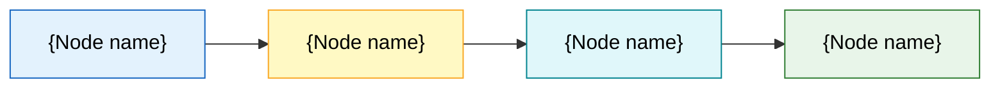

# {Document Title}

<!--
TEMPLATE NOTES (delete this comment block when using)
- Purpose: the **generic skeleton for every Markdown design document in this project**, distilled from `docs/platform/business_overview.md` as the baseline.
- Usage: copy this file to the target location → drop the leading underscore from the file name → delete this comment block → replace the `{curly brace}` placeholders section by section.
- Hard structure (not adjustable):
  1. The level-1 heading is the document title, immediately followed by the **document information table** (version / author / creation date).
  2. Next comes the `# Index` table of contents; anchors must match the actual headings.
  3. **The first section is always `# 0 Document Notes`.**
  4. Intermediate sections start at `# 1` and may be added or removed as needed; the numbering must be continuous.
  5. **The last section is always `# N Appendix`**, and it must contain a "Common Status Colors" section.
- Adjustable parts: the number, titles, and levels of the intermediate sections; subsections of the appendix other than "Common Status Colors" may be added or removed.
- Numbering convention: always use numeric numbering `1` / `1.1` / `1.1.1`; after deleting a section you must renumber and update the Index accordingly.
- Placeholders: every `{curly brace}` item must be replaced; none may remain in a finalized document.
- Tables first: anything that can be expressed as a table must be expressed as a table (properties, parameters, behaviors, comparisons).
- Diagrams live in their own files: a `.mmd` source file plus a rendered `.png`; embed the png in the body and link to the mmd source. Colors follow
  the 9-color palette in `docs/template/mermaid/mmd_style_guide.md` §3.1.
-->

| Item | Content |
|---|---|
| **Document Title** | {Document Title} |
| **Document Version** | {x.y} |
| **Author** | {Author} |
| **Created** | {YYYY-MM-DD} |
| **Last Updated** | {YYYY-MM-DD} |

---

# Index

- [0 Document Notes](#0-document-notes)
- [1 {Section Title}](#1-section-title)
  - [1.1 {Subsection Title}](#11-subsection-title)
    - [1.1.1 {Sub-subsection Title}](#111-sub-subsection-title)
  - [1.2 {Subsection Title}](#12-subsection-title)
- [2 {Section Title}](#2-section-title)
  - [2.1 {Subsection Title}](#21-subsection-title)
  - [2.2 {Subsection Title}](#22-subsection-title)
- [3 {Section Title}](#3-section-title)
- [4 Appendix](#4-appendix)
  - [4.1 Glossary](#41-glossary)
  - [4.2 Common Status Colors](#42-common-status-colors)
    - [4.2.1 Status Color Definitions](#421-status-color-definitions)
    - [4.2.2 Usage Scenarios](#422-usage-scenarios)
    - [4.2.3 Mermaid Usage](#423-mermaid-usage)
  - [4.3 References](#43-references)
  - [4.4 Change Log](#44-change-log)

---

# 0 Document Notes

| Item | Content |
|---|---|
| **Document Name** | {Document display name} (`{file_name}.md`) |
| **Document Level** | {Platform-level / Component-level / Standard-level / Process-level} — {one sentence describing the scope this document covers} |
| **Document Version** | {x.y} |
| **Intended Readers** | {Product manager / Architect / AI developer / Test engineer / Newly onboarded engineer} |
| **Related Documents** | `{relative/path/to/related_doc.md}` |

> **Document Boundary**: {State which questions this document is responsible for answering, and explicitly state what is not fixed here (for example tech stack, APIs, algorithm implementation).}
>
> **Document Relationships**: {State the dependencies and authority relationships between this document and its upstream/downstream documents; which one prevails in case of conflict.}

---

# 1 {Section Title}

{Section introduction: one paragraph stating the problem this section addresses.}

## 1.1 {Subsection Title}

{Body text. Anything that can be tabulated must be a table.}

### 1.1.1 {Sub-subsection Title}

{Body text.}

## 1.2 {Subsection Title}

| {Column 1} | {Column 2} | {Column 3} |
|---|---|---|
| {Value} | {Value} | {Value} |

---

# 2 {Section Title}

## 2.1 {Subsection Title}

{Body text.}

## 2.2 {Subsection Title}

{Diagram example — source file and rendered image kept separate:}

> Source file: [{diagram_name}.mmd](./{diagram_name}.mmd)

---

# 3 {Section Title}

{Add or remove intermediate sections as needed, keep the numbering continuous, and update the Index accordingly.}

---

# 4 Appendix

## 4.1 Glossary

| Term | English / Code Name | Definition |
|---|---|---|
| {Term} | {English / code_name} | {Definition} |
| {Term} | {English / code_name} | {Definition} |

## 4.2 Common Status Colors

This section defines the project-wide status color scheme. All documents, diagrams, and interfaces **must** use the values in the
table below when expressing a "status". Adding new statuses or altering the color values is not allowed. The color values are taken
from the 9-color palette in `docs/template/mermaid/mmd_style_guide.md` §3.1, so document tables and Mermaid diagrams are consistent by construction.

### 4.2.1 Status Color Definitions

| Status Code | Label | Meaning | Palette | Fill | Stroke | Text Color | Marker |
|---|---|---|---|---|---|---|---|
| `planned` | Planned | Scheduled but not yet started | `BLUE` | `#E3F2FD` | `#1565C0` | `#000000` | 🔵 |
| `doning` | In Progress | Underway, not yet finished | `YELLOW` | `#FFF9C4` | `#F9A825` | `#000000` | 🟡 |
| `partial` | Partially Done | Partly completed and deliverable, with a clearly defined remainder still outstanding | `CYAN` | `#E0F7FA` | `#00838F` | `#000000` | ◐ |
| `done` | Done | Completed and accepted | `GREEN` | `#E8F5E9` | `#2E7D32` | `#000000` | 🟢 |
| `error` | Error | Execution failed or the result is incorrect; needs fixing | `PINK` | `#FADBD8` | `#C0392B` | `#000000` | 🔴 |
| `panding` | Pending | Paused on an external dependency or a decision, waiting to resume | `PURPLE` | `#F3E5F5` | `#6A1B9A` | `#000000` | 🟣 |
| `canceled` | Canceled | Abandoned, no longer in scope | `GREY` | `#F5F5F5` | `#616161` | `#000000` | ⚪ |
| `warning` | Warning | Can continue, but there is a risk or deviation that needs attention | `ORANGE` | `#FFF3E0` | `#EF6C00` | `#000000` | 🟠 |

> The status code is the authoritative identifier; the label is for reading only. Code, configuration, and data structures always use the raw status code.

### 4.2.2 Usage Scenarios

| Scenario | Usage |
|---|---|
| Document tables | Write the marker plus the label in the "Status" column, for example `🟢 Done`; do not mix markers and plain text within a single column |
| Mermaid diagrams | Define status classes with `classDef` and reference them on nodes with the `:::status_code` suffix, see §4.2.3 |
| Frontend UI | Tags, badges, and status dots use the fill as background, the stroke as border, and `#000000` as text color |
| Logs and terminals | Use the raw status code only; do not emit color escapes — leave coloring to the viewer |

### 4.2.3 Mermaid Usage

## 4.3 References

| No. | Name | Location / Link | Notes |
|---|---|---|---|
| {R1} | {Reference name} | `{relative/path or URL}` | {Notes} |

## 4.4 Change Log

| Version | Date | Changed By | Description |
|---|---|---|---|
| {x.y} | {YYYY-MM-DD} | {Author} | {Description of change} |
